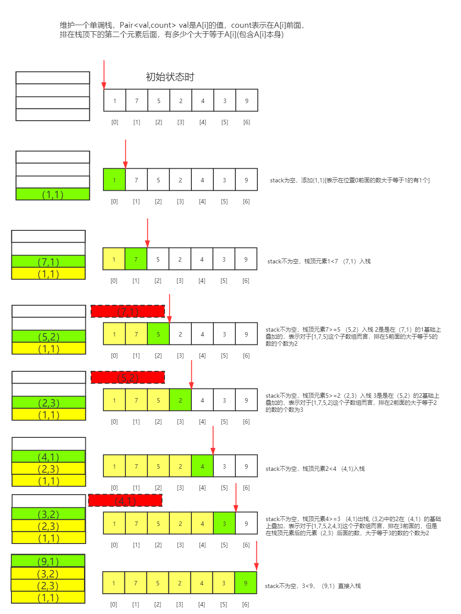

#题目描述
907. 子数组的最小值之和
给定一个整数数组 arr，找到 min(b) 的总和，其中 b 的范围为 arr 的每个（连续）子数组。
由于答案可能很大，因此 返回答案模 10^9 + 7 。
###示例 1：
输入：arr = [3,1,2,4]
输出：17
解释：
子数组为 [3]，[1]，[2]，[4]，[3,1]，[1,2]，[2,4]，[3,1,2]，[1,2,4]，[3,1,2,4]。 
最小值为 3，1，2，4，1，1，2，1，1，1，和为 17。
###示例 2：
输入：arr = [11,81,94,43,3]
输出：444
##解法一：
这道题的本质在于找到数组中的每一个数作为最小值的范围，比如对于某个数nums[i]能够最小值以这种形式表示：左边连续m个数比nums[i]大，右边连续n个数比nums[i]大。

因此，当前目标是找到每一个数nums[i]的左右两边第一个小于等于的数nums[prev]，这两个数之间的数则均是大于nums[i]，这样便可以计算出m和n。在一个数组中找左右两边第一个大于、小于、等于的数这种问题可以使用单调栈来解决。
```import java.util.ArrayDeque;
import java.util.Deque;

public class Solution {

    public int sumSubarrayMins(int[] A) {
        int MOD = 1000000007;
        int N = A.length;

        // 第 1 步：计算当前下标 i 的左边第 1 个比 A[i] 小的元素的下标
        Deque<Integer> stack1 = new ArrayDeque<>();
        int[] prev = new int[N];
        for (int i = 0; i < N; i++) {
            while (!stack1.isEmpty() && A[i] <= A[stack1.peekLast()]) {
                stack1.removeLast();
            }
            prev[i] = stack1.isEmpty() ? -1 : stack1.peekLast();
            stack1.addLast(i);
        }

        // 第 2 步：计算当前下标 i 的右边第 1 个比 A[i] 小的元素的下标
        Deque<Integer> stack2 = new ArrayDeque<>();
        int[] next = new int[N];
        for (int i = N - 1; i >= 0; i--) {
            while (!stack2.isEmpty() && A[i] < A[stack2.peekLast()]) {
                stack2.removeLast();
            }
            next[i] = stack2.isEmpty() ? N : stack2.peekLast();
            stack2.addLast(i);
        }

        // 第 3 步：计算结果
        long ans = 0;
        for (int i = 0; i < N; ++i) {
            // 注意：乘法可能越界，须要先转成 long 类型
            ans += (long) (i - prev[i]) * (next[i] - i) % MOD * A[i] % MOD; //(i - prev[i]) * (next[i] - i)为A[i]作为最小的数组个数
            ans %= MOD;
        }
        return (int) ans;
    }
}
```

##解法二：

```
class Solution {
    public int sumSubarrayMins(int[] A) {
        int MOD =  1000000007;

        Stack<RepInteger> stack = new Stack();
        int ans = 0, dot = 0;
        for (int j = 0; j < A.length; ++j) {
            // Add all answers for subarrays [i, j], i <= j
            int count = 1;
            while (!stack.isEmpty() && stack.peek().val >= A[j]) {
                RepInteger node = stack.pop();
                count += node.count;
                dot -= node.val * node.count;
            }
            stack.push(new RepInteger(A[j], count));
            dot += A[j] * count;
            ans += dot;
            ans %= MOD;
        }
        return ans;
    }
}

class RepInteger {
    int val, count;
    RepInteger(int v, int c) {
        val = v;
        count = c;
    }
}
```

